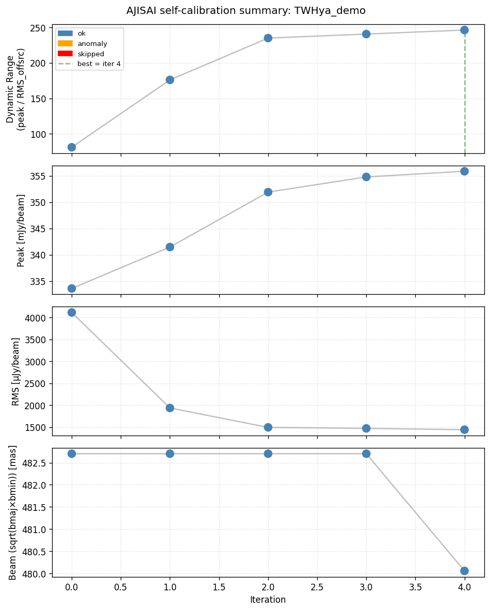
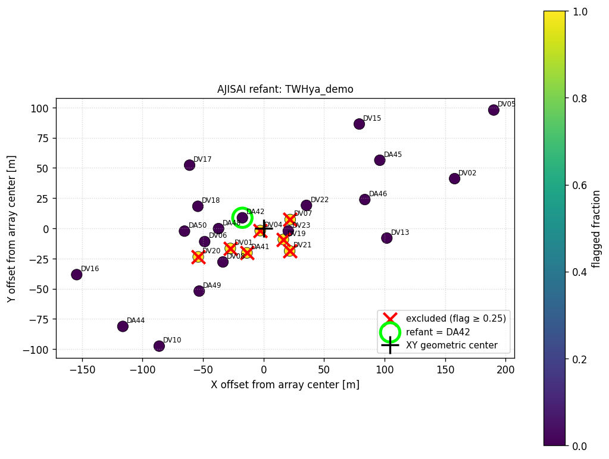

# AJISAI

**Automated Justification-based Imaging and Self-calibration for ALMA Infrastructure**

AJISAI is a fully automated, reproducible, and explainable self-calibration
pipeline for ALMA continuum data, built on top of CASA.

[](https://github.com/Y-Masayuki/AJISAI/actions/workflows/ci.yml)
[](https://ajisai.readthedocs.io/en/latest/)
[](https://opensource.org/licenses/MIT)
[](https://www.python.org/downloads/)

## Design principles

1. **Fire-and-forget.** Minimum required input is the measurement set path.
   All other parameters have sensible defaults derived from the data itself.
2. **Justification-based.** Every parameter choice (reference antenna,
   cell size, image size, solution intervals, masking strategy, ...) is
   recorded in a structured `justification.json` file with the rationale,
   so the run is auditable and the choices are reproducible in publications.
3. **Deterministic.** A fixed self-calibration schedule (3 phase iterations
   + 1 amplitude iteration by default) runs to completion; the best image is
   selected by dynamic range at the end. No adaptive rollback that would
   make the result depend on run-order.

## Installation

AJISAI requires CASA at runtime (either a monolithic CASA distribution or
modular CASA installed via pip). The current install method is from GitHub
source; a PyPI release is planned for a future version.

```bash
# Install the v0.1.0 release directly from GitHub
pip install "git+https://github.com/Y-Masayuki/AJISAI.git@v0.1.0"

# Or for the latest development snapshot
pip install "git+https://github.com/Y-Masayuki/AJISAI.git@main"
```

For development (editable install with tests):

```bash
git clone https://github.com/Y-Masayuki/AJISAI.git
cd AJISAI
pip install -e ".[dev]"
```

Full documentation is hosted on Read the Docs:
**https://ajisai.readthedocs.io**

## Example results: TW Hya Band 7 demo

To verify the pipeline end-to-end, AJISAI was run on the public
[ALMA TW Hya Band 7 dataset](https://casaguides.nrao.edu/index.php?title=First_Look_at_Imaging_CASA_6)
(Project 2011.0.00340.S) via `examples/run_twhya_demo.py`. With default
settings, three phase + one amplitude self-cal iterations completed
without any anomalies.

<p align="center">
  
</p>

| metric           | iter 0 (no self-cal) | iter 4 (best) | change                    |
| ---------------- | -------------------- | ------------- | ------------------------- |
| Dynamic range    | 81.06                | 246.49        | **3.04x up**              |
| Peak [mJy/beam]  | 333.59               | 355.91        | +22.32 mJy (+6.7%)        |
| RMS  [uJy/beam]  | 4115.18              | 1443.90       | **2.85x down**            |
| Beam [mas]       | 482.8                | 480.1         | essentially unchanged     |

AJISAI's hybrid reference-antenna selection chose `DA42`, the antenna
closest to the XY geometric center of the array among the 19 antennas
(out of 26) that passed the flag-fraction threshold (<25%):

<p align="center">
  
</p>

Reference output files from this run are committed to the repository for
exact comparison: [`metrics.csv`](docs/_static/metrics.csv) and
[`justification.json`](docs/_static/justification.json). See the
[TW Hya tutorial](https://ajisai.readthedocs.io/en/latest/tutorials/twhya.html)
for the full walk-through.

## Quick start

```python
from ajisai import AJISAI, AJISAIConfig

cfg = AJISAIConfig(vis="/path/to/data.ms")
aj = AJISAI(cfg).run()

print(aj.best_image)         # path to the best CLEAN image
print(aj.best_metric_value)  # the dynamic range achieved
print(aj.metrics)            # per-iteration metrics (DataFrame)
print(aj.justification)      # full structured rationale
```

After the run, the working directory contains:

```
ajisai_<projname>/
  ajisai_refant_selection.png   # which antenna was chosen, and why
  metrics.csv                    # per-iteration peak / RMS / SNR / DR / beam
  selfcal_summary.png            # 4-panel diagnostic plot
  justification.json             # structured rationale for every decision
  final.image / final.fits       # the best CLEAN image
  intermediate/                  # all intermediate MS files and images
  diagnostics/                   # per-iteration gain plots
```

## Multi-field workflow

For measurement sets containing several target fields:

```python
from ajisai import AJISAI, AJISAIConfig, list_target_fields

vis = "/path/to/multi_field.ms"

for f in list_target_fields(vis):
    cfg = AJISAIConfig(
        vis=vis,
        field=f["id"],                # field ID as string
        projname=f"run_{f['name']}",  # one output dir per field
    )
    AJISAI(cfg).run()
```

## Advanced configuration

`AJISAIConfig` exposes sub-configs for imaging, gain calibration, and the
self-cal schedule. All have defaults; override only what you need.

```python
from ajisai import (
    AJISAI, AJISAIConfig, ImagingConfig, GainCalConfig,
    SelfcalSchedule, SelfcalStep,
)

cfg = AJISAIConfig(
    vis="/path/to/data.ms",
    # Optional: shift the source to the phase center first
    phase_shift=True,
    # Optional: supply phase center manually (frame is required)
    phase_center=("16:25:45.0", "-24:12:23.0", "ICRS"),
    # Sub-configs
    imaging=ImagingConfig(robust=0.5, mask_mode="auto-multithresh"),
    gaincal=GainCalConfig(minsnr=1.5, gaintype="T"),
    schedule=SelfcalSchedule(steps=(
        SelfcalStep("p", "inf",  label="phase_inf"),
        SelfcalStep("p", "6*IT", label="phase_6IT"),
        SelfcalStep("p", "3*IT", label="phase_3IT"),
        SelfcalStep("a", "inf",  solnorm=True, label="amp_inf"),
    )),
)
AJISAI(cfg).run()
```

## Tools

The `tools/` directory contains standalone diagnostic utilities:

* `sigma_clip_rms_test.py` — compares five off-source RMS estimators on a
  CASA-exported FITS image to validate the sigma-clipping-based default
  used in AJISAI.

## License

MIT — see [LICENSE](LICENSE).

## Citation

If AJISAI helps your work, please cite [`Yamaguchi et al. 2026`](https://arxiv.org/abs/2605.11486)  and the software itself via the Zenodo DOI (to be assigned at first GitHub release).

## Author

Masayuki Yamaguchi (Kyushu Univ. / NAOJ)

