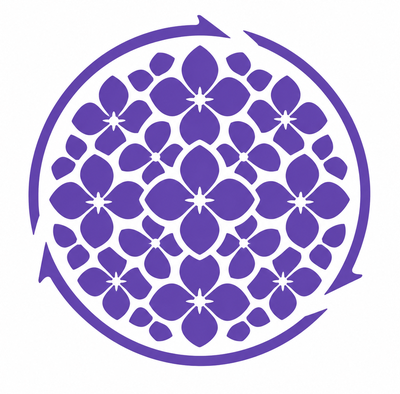
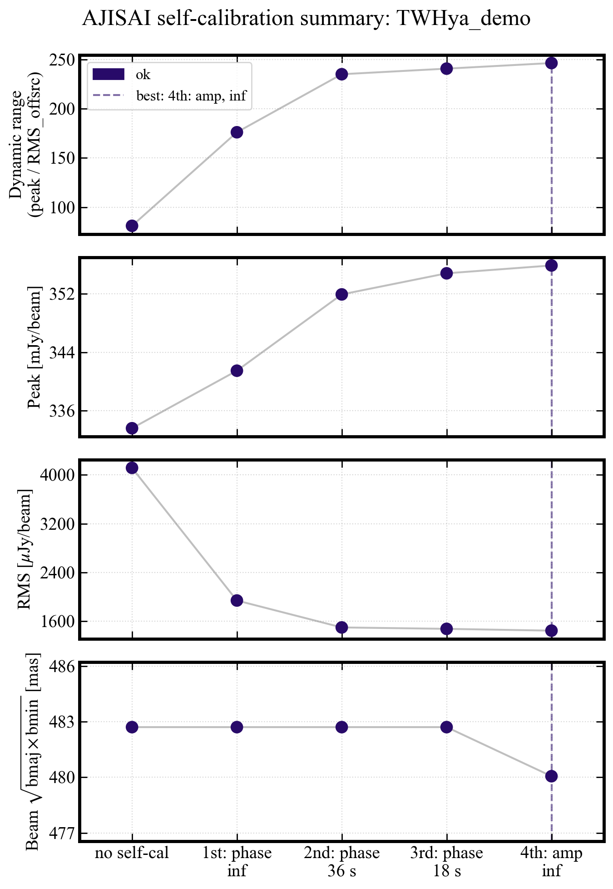
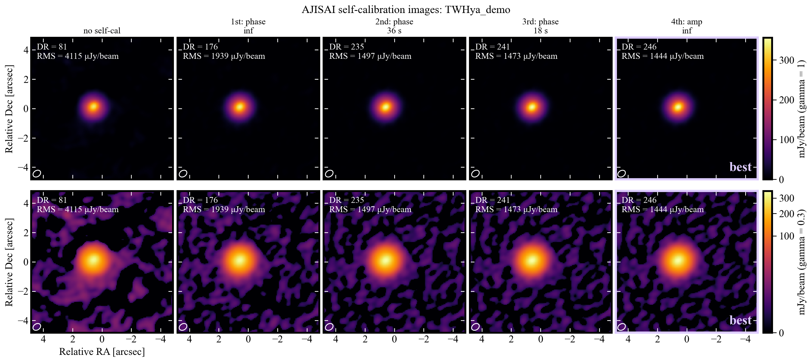
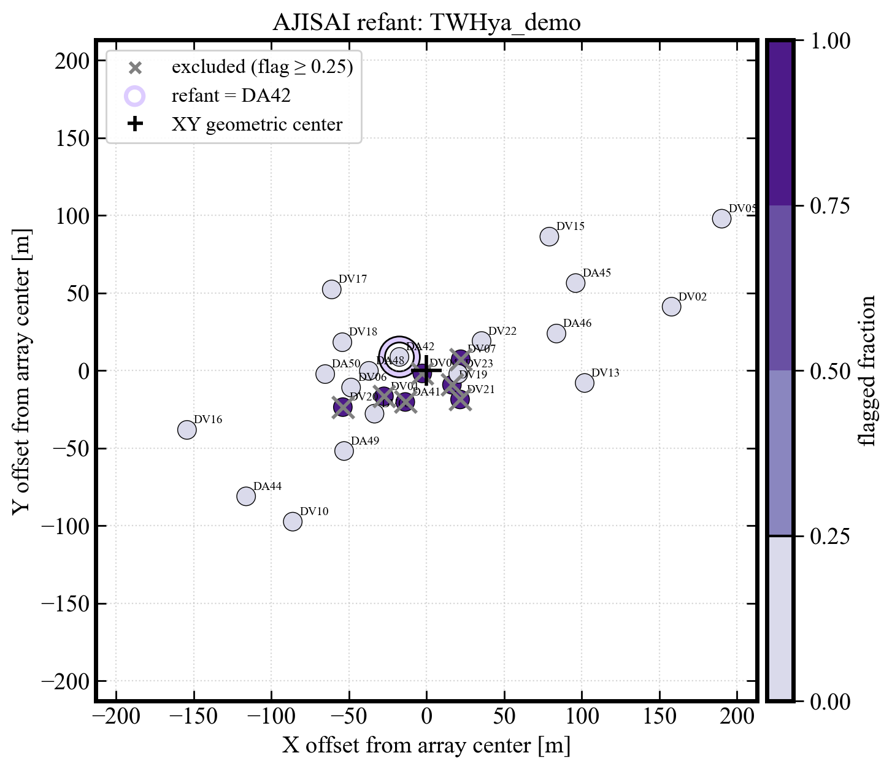

# AJISAI: Automated Justification-based Imaging and Self-calibration for ALMA Infrastructure 

[](https://github.com/Y-Masayuki/AJISAI/actions/workflows/ci.yml)
[](https://ajisai.readthedocs.io/en/latest/)
[](https://opensource.org/licenses/MIT)
[](https://www.python.org/downloads/)
[](https://doi.org/10.5281/zenodo.23053992)

# AJISAI

AJISAI is a fully automated, reproducible, and explainable self-calibration pipeline for ALMA continuum data, built on top of CASA. The name is inspired by the Japanese word for hydrangea (紫陽花).


## Design principles

1. **Fire-and-forget.** Minimum required input is the measurement set path.
   All other parameters have sensible defaults derived from the data itself.
2. **Justification-based.** Every parameter choice (reference antenna,
   cell size, image size, solution intervals, masking strategy, ...) is
   recorded in a structured `justification.json` file with the rationale,
   so the run is auditable and the choices are reproducible in publications.
3. **Deterministic.** A fixed self-calibration schedule (3 phase iterations
   + 1 amplitude iteration by default) runs to completion; the best image is
   selected by dynamic range at the end. No adaptive rollback that would
   make the result depend on run-order.


## Installation

AJISAI requires CASA at runtime (either a monolithic CASA distribution or
modular CASA installed via pip). The current install method is from GitHub
source; a PyPI release is planned for a future version.

```bash
pip install "git+https://github.com/Y-Masayuki/AJISAI.git@main"
```

For development (editable install with tests):

```bash
git clone https://github.com/Y-Masayuki/AJISAI.git
cd AJISAI
pip install -e ".[dev]"
```

Full documentation is hosted on Read the Docs:
**https://ajisai.readthedocs.io**

## Example results: TW Hya Band 7 demo

To verify the pipeline end-to-end, AJISAI was run on the public
[ALMA TW Hya Band 7 dataset](https://casaguides.nrao.edu/index.php?title=First_Look_at_Imaging_CASA_6)
(Project 2011.0.00340.S) via `examples/run_twhya_demo.py`. With default
settings, three phase + one amplitude self-cal iterations completed
without any anomalies.

<p align="center">
  
</p>

| metric           | iter 0 (no self-cal) | iter 4 (best) | change                    |
| ---------------- | -------------------- | ------------- | ------------------------- |
| Dynamic range    | 81.06                | 246.49        | **3.04x up**              |
| Peak [mJy/beam]  | 333.59               | 355.91        | +22.32 mJy (+6.7%)        |
| RMS  [uJy/beam]  | 4115.18              | 1443.90       | **2.85x down**            |
| Beam [mas]       | 482.8                | 480.1         | essentially unchanged     |

`selfcal_images.png` shows the CLEAN image of every round side by side on a
shared colour scale (top row linear, bottom row with a gamma = 0.3 stretch
that brings up the noise pattern); the best round is framed:

<p align="center">
  
</p>

AJISAI's hybrid reference-antenna selection chose `DA42`, the antenna
closest to the XY geometric center of the array among the 19 antennas
(out of 26) that passed the flag-fraction threshold (<25%):

<p align="center">
  
</p>

Reference output files from this run are committed to the repository for
exact comparison: [`metrics.csv`](docs/_static/metrics.csv) and
[`justification.json`](docs/_static/justification.json). See the
[TW Hya tutorial](https://ajisai.readthedocs.io/en/latest/tutorials/twhya.html)
for the full walk-through.

## Quick start

```python
from ajisai import AJISAI, AJISAIConfig

cfg = AJISAIConfig(vis="/path/to/data.ms")
aj = AJISAI(cfg).run()

print(aj.best_image)         # path to the best CLEAN image
print(aj.best_metric_value)  # the dynamic range achieved
print(aj.metrics)            # per-iteration metrics (DataFrame)
print(aj.justification)      # full structured rationale
```

After the run, the working directory contains:

```
ajisai_<projname>/
  ajisai_refant_selection.png   # which antenna was chosen, and why
  metrics.csv                    # per-iteration peak / RMS / SNR / DR / beam
  selfcal_summary.png            # 4-panel diagnostic plot
  selfcal_images.png             # CLEAN image of every iteration, side by side
  justification.json             # structured rationale for every decision
  final.image / final.fits       # the best CLEAN image
  intermediate/                  # all intermediate MS files and images
  diagnostics/                   # per-iteration gain plots
```

## Multi-field workflow

For measurement sets containing several target fields:

```python
from ajisai import AJISAI, AJISAIConfig, list_target_fields

vis = "/path/to/multi_field.ms"

for f in list_target_fields(vis):
    cfg = AJISAIConfig(
        vis=vis,
        field=f["id"],                # field ID as string
        projname=f"run_{f['name']}",  # one output dir per field
    )
    AJISAI(cfg).run()
```

## Advanced configuration

`AJISAIConfig` exposes sub-configs for imaging, gain calibration, the
self-cal schedule, and the diagnostic figures. All have defaults; override
only what you need. For example:

```python
from ajisai import (
    AJISAI, AJISAIConfig, ImagingConfig, GainCalConfig,
    SelfcalSchedule, SelfcalStep,
)

cfg = AJISAIConfig(
    vis="/path/to/data.ms",
    # Optional: shift the source to the phase center first
    phase_shift=True,
    # Optional: supply phase center manually (frame is required)
    phase_center=("16:25:45.0", "-24:12:23.0", "ICRS"),
    # Sub-configs
    imaging=ImagingConfig(robust=0.5, mask_mode="auto-multithresh"),
    gaincal=GainCalConfig(minsnr=1.5, gaintype="T"),
    schedule=SelfcalSchedule(steps=(
        SelfcalStep("p", "inf",  label="phase_inf"),
        SelfcalStep("p", "6*IT", label="phase_6IT"),
        SelfcalStep("p", "3*IT", label="phase_3IT"),
        SelfcalStep("a", "inf",  solnorm=True, label="amp_inf"),
    )),
)
AJISAI(cfg).run()
```

Every option, with its default value and the allowed alternatives, is listed
in [`examples/full_config_template.py`](examples/full_config_template.py).
Running it unchanged (after setting `vis`) is the same as the defaults; copy
it and change only the lines you need. The
[configuration reference](https://ajisai.readthedocs.io/en/latest/configuration.html)
explains each parameter.

## Tools

The `tools/` directory contains standalone diagnostic utilities:

* `sigma_clip_rms_test.py` — compares five off-source RMS estimators on a
  CASA-exported FITS image to validate the sigma-clipping-based default
  used in AJISAI.

## Support and contributing

Bug reports and questions are welcome on
[GitHub Issues](https://github.com/Y-Masayuki/AJISAI/issues). For bug
reports, please include your AJISAI and CASA versions, the command you ran,
and the `justification.json` from the affected run. Support is provided on a
best-effort basis; we usually reply within one to two weeks.

Contributions are welcome. Please read [CONTRIBUTING.md](CONTRIBUTING.md) for
the development setup, testing and lint instructions, and the project's design
policy (a deterministic fixed schedule; no adaptive rollback or heuristics).

## License

MIT — see [LICENSE](LICENSE).

## Citation

If AJISAI helps your work, please cite both the paper describing the method and the specific version of the software you used.

**Paper** (the self-calibration procedure is described in Appendix B):
Yamaguchi, M., Machida, M. N., Tominaga, R. T., et al. 2026, ApJ, 1006, 232, [doi:10.3847/1538-4357/ae819b](https://doi.org/10.3847/1538-4357/ae819b)

**Software** (v0.2.1):
Yamaguchi, M. 2026, AJISAI: Automated Justification-based Imaging and Self-calibration for ALMA Infrastructure, v0.2.1, Zenodo, [doi:10.5281/zenodo.23094438](https://doi.org/10.5281/zenodo.23094438)

Each release has its own version DOI on Zenodo; cite the one matching the version you used. The concept DOI [10.5281/zenodo.23053992](https://doi.org/10.5281/zenodo.23053992) always resolves to the latest release. You can also use the "Cite this repository" button on GitHub, which reads `CITATION.cff`.

```bibtex
@article{yamaguchi2026v1094sco,
  author  = {Yamaguchi, Masayuki and Machida, Masahiro N. and Tominaga, Ryosuke T. and Sai, Jinshi and Muto, Takayuki and Takami, Michihiro and Liu, Hauyu Baobab and Shoshi, Ayumu and Tsukagoshi, Takashi and Ishibashi, Shu},
  title   = {A Hybrid Origin for the Multiple Ring-gap Structures in the Large Protoplanetary Disk V1094 Sco: A Low-mass Planet and Secular Gravitational Instability},
  journal = {The Astrophysical Journal},
  year    = {2026},
  volume  = {1006},
  pages   = {232},
  doi     = {10.3847/1538-4357/ae819b}
}

@software{yamaguchi2026ajisai,
  author    = {Yamaguchi, Masayuki},
  title     = {{AJISAI}: Automated Justification-based Imaging and Self-calibration for {ALMA} Infrastructure},
  version   = {v0.2.1},
  publisher = {Zenodo},
  year      = {2026},
  doi       = {10.5281/zenodo.23094438},
  url       = {https://doi.org/10.5281/zenodo.23094438}
}
```


## Author

Masayuki Yamaguchi (Kyushu Univ. / NAOJ)

